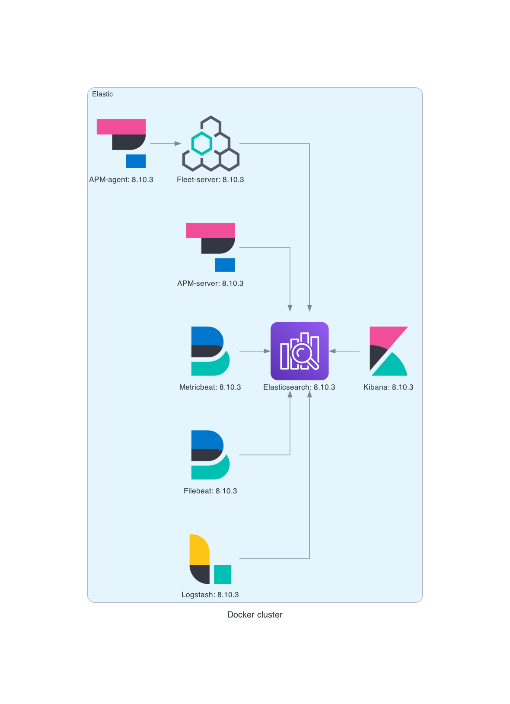

# Elastic Stack Docker Compose Repository

This repository contains a Docker Compose file that allows you to easily set up and deploy the Elastic Stack, consisting of Elasticsearch, Kibana, Logstash, Filebeat, and Metricbeat.

The Elastic Stack is a powerful suite of open-source tools used for centralized logging, log analysis, and monitoring.



## Contents

* Prerequisites
* Usage
* Configuration
* Contributing
* License

## Prerequisites

Before using this Docker Compose configuration, make sure you have the following prerequisites installed on your system:

* Docker: [Install Docker](https://docs.docker.com/install/)
* Docker Compose: [Install Docker Compose](https://docs.docker.com/compose/install/)

## Usage
To start the Elastic Stack services, follow these steps:

1. Clone this repository to your local machine.
2. Navigate to the repository directory.

```bash
$ git clone https://github.com/your-username/elastic-stack-docker.git
$ cd elastic-stack-docker
```

3. Adjust the configuration files as needed (see the Configuration section below).
4. Start the services using Docker Compose.

```bash
$ docker-compose up -d
```

This command will pull the necessary Docker images, create and start the containers in the background. Please note that the first startup might take a few minutes as the images are downloaded.

5. Once the services are up and running, you can access the following components:
* Elasticsearch: http://localhost:9200
* Kibana: http://localhost:5601

## Example messages

### Logstash

This will post a minimal message on port `5044` where logstash is listening on:

```bash
curl -XPOST -H "Content-Type: application/json" -d '{
  "@timestamp": "2023-07-13T12:34:56.789Z",
  "message": "This is a sample log entry.",
  "severity": "INFO",
  "source": "example.com",
  "application": "myapp"
}' http://localhost:5044
```

## Configuration

The configuration files for each component are located in the config directory. Feel free to modify these files according to your requirements.

Here's a brief overview of each component's configuration directories:

* Logstash: `logstash-config` & `logstash-pipeline`
* Filebeat: `filebeat-config`

Make sure to restart the respective services after making any changes to the configuration files.

## Contributing
If you encounter any issues or have suggestions for improvements, please feel free to open an issue or submit a pull request. We welcome contributions from the community!
